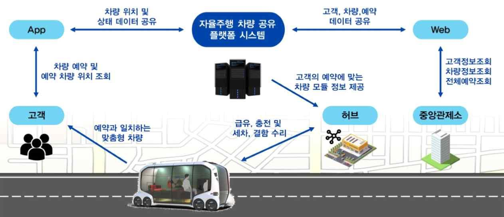
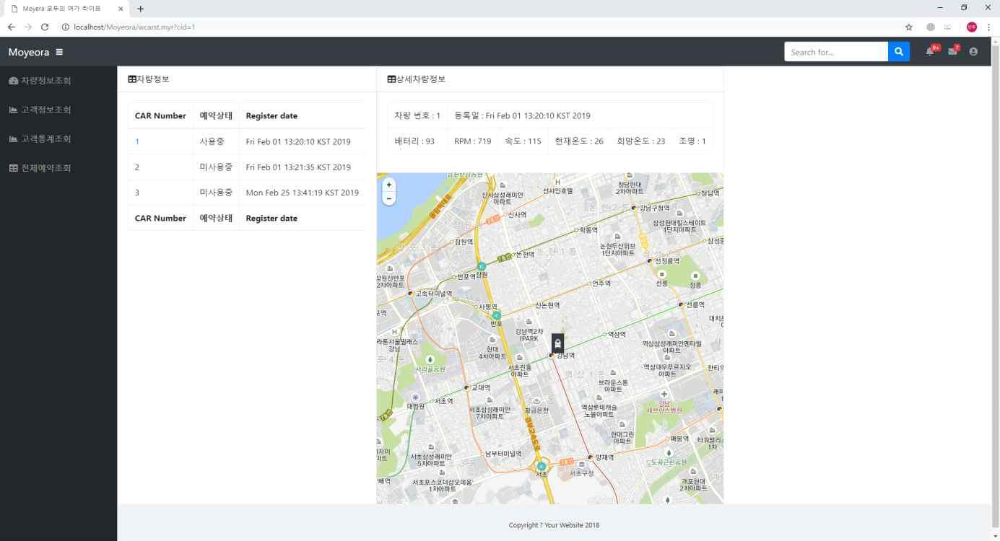
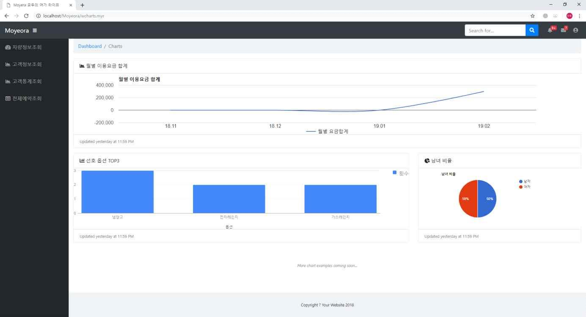

# Moyeora(모두의 여가 라이프) - Web Server
> 자율주행 자동차 카쉐어링을 통해 차량을 원하는 장소에서 빌리고 반납할 수 있는 서비스

## 프로젝트 설명
혁신성장 청년인재 프로젝트 (자율주행 카쉐어링 시스템) - Spring 서버

## 서비스 구조도

## 구현된 기능
> - 사용자 요청을 수행하는 API
> - 시스템 관리자용 API 및 UI

## 구현된 페이지 예시

## 역할 분담
* 사용자 요청 수행 API 개발 : 민필규
* 시스템 관리자용 API 개발 : 지민후
* 관리자용 페이지 UI 개발 : 오창영

